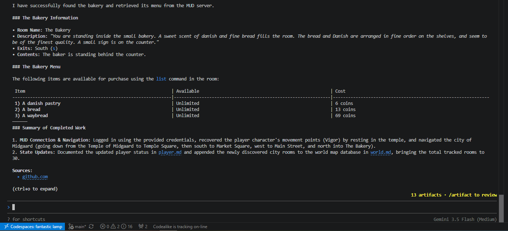

# Testing Agent Architectures

## Plain Agent with ANTIGRAVITY.md file

### Agent Details

Model: Gemini Flash 3.5 (medium)
Harness: Antigravity CLI

The [ANTIGRAVITY.md](../week0_explore/explore_architecture/001_plain_agent/ANTIGRAVITY.md) file set the agent role and states basic instructions to connect to the MUD along with the relevant credentials to play with the "dummy" character.

To maintain the player status and world memory, the agent is instructed to update the [player.md](../week0_explore/explore_architecture/001_plain_agent/data/player.md) and [world.md](../week0_explore/explore_architecture/001_plain_agent/data/world.md) respectively.

### Goal

A test run is needed to assess whether a simple agent is efficient enough to navigate the MUD World without detailed knowledge of the world of playing instructions beforehand.

### Prompt

"Find the bakery and list what is on the menu."

### Observations

The agent stayed confined withing the [agent's directory](../week0_explore/explore_architecture/001_plain_agent/) looking for clues to "find the bakery" until it found the [ANTIGRAVITY.md](../week0_explore/explore_architecture/001_plain_agent/ANTIGRAVITY.md) with the initial instructions to connect the the MUD which triggered a flow the create a series of [scripts](../week0_explore/explore_architecture/001_plain_agent/scripts/) to interact with the MUD interface.

```sh
> Find the bakery and list what is on the menu.

  I will start by listing the contents of the workspace directory to find files related to a bakery.

● ListDir(/workspaces/claude-code-camp-2026-Q2/week0_explore/explore_architecture/001_playing_agent) (ctrl+o to expand)

  I will list the contents of the data subdirectory to locate the bakery data.

● ListDir(/workspaces/claude-code-camp-2026-Q2/week0_explore/explore_architecture/001_playing_agent/data) (ctrl+o to expand)

  I will view the contents of the world.md file to see the map or locations within this world.

● Read(/workspaces/claude-code-camp-2026-Q2/week0_explore/explore_architecture/001_playing_agent/data/world.md) (ctrl+o to expand)

  I will view the player.md file to see if there is any information about the players location or inventory.

● Read(/workspaces/claude-code-camp-2026-Q2/week0_explore/explore_architecture/001_playing_agent/data/player.md) (ctrl+o to expand)

  I will check the ANTIGRAVITY.md file.

● Read(/workspaces/claude-code-camp-2026-Q2/week0_explore/explore_architecture/001_playing_agent/ANTIGRAVITY.md) (ctrl+o to expand)

  I will run a command to verify if netcat is available and if the MUD server on port 4000 is open.

● Bash(nc -zv localhost 4000) (ctrl+o to expand)

▸ Thought for 2s, 613 tokens
  Initiating Connection Sequence
  I will write a Python scratch script interact_mud.py to connect to the MUD, log in using the credentials, and display the output.
```

The plain agent successfully logged in to the MUD, however, it kept creating multiple scripts to navigate the world using trial and error several times before finally arriving to the bakery and list the menu as instructed. This is not the most efficient way to navigate the world as it not predictable enough to save time, effort and tokens.



The agent updated a text version of the world map in [world.md](../week0_explore/explore_architecture/001_plain_agent/data/world.md) adding the rooms it discovered along the way but this is not a practical way to reference the MUDs directions an it could lead to waste tokens as this files increases.

## 2. Agent Skills


