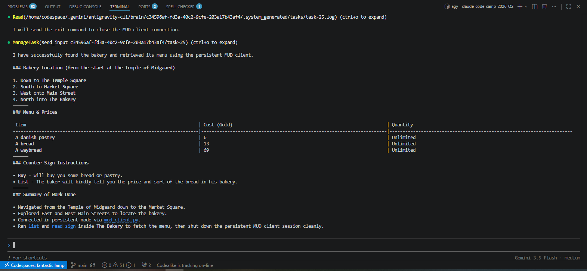

# Preweek Technical Documentation

## Technical Goal

Different Agent Architectures need to be tested to determine which one (if any) is the most efficient to our business use-case.

The specific Agent Architectures studied here are:

- An agent file with referenced files eg. AGENT.md,  @~/docs/*.MD
- Agent Skills driven by main agent eg. ~/.skills

<!-- The technical goal of Preweek (Explore) is to determine how well do Agent Architectures fit our business use-case.

[Ref 1] Examples of Agent Architectures That Scale With Effort:

- An agent file with referenced files eg. AGENT.md,  @~/docs/*.MD
- Agent Skills driven by main agent eg. ~/.skills
- Filesystem Subagent driven by a coding harness or Coding Agent SDK eg. ~/subagents
- AI workflow automation platform eg. n8n
- Use a generic AI Agent SDK that leverages plug and plays generic AI packages.
- Use low level first-party LLM SDKs and write our own agentic loop
- Use REST APIs directly, write our own agentic loop
  - The agentic loop is model-driven orchestration  with middleware programmatic guidance
  - The agentic loop is code-driven orchestration -->

## Technical Uncertainty

- Confirmation is needed to assert weather or not a coding harness is efficient or productive enough to handle a non-coding workload (like navigating a text based game).
- It is not clear how and LLM/agent could take on different personas (newbie, veteran, casual) and report accordingly the player experience and posibly pain points in the real world.
- It's not known if LLM's model's thinking if sufficient to hold the memory context to drive decisions pertinent to our specific use case.
- Is unclear is a coding harness can interface with a MUD without specialized tooling of SDK to manage network sessions.
- Due to changes in Google tooling, Gemini CLI can't be used with subscriptions so is necessary to change to Antigravity CLI and assert if is a sufficient agentic harness.

## Technical Hypotheses

- Based on my own experience, issues might arise when the coding harness try to navigate the MUD without a specialized interface or defined API as the commands to be input need run on a live monitored protocol like [Netcat](https://linuxize.com/post/netcat-nc-command-with-examples/).
- The reasoning needed to identify pain points according to the players level or persona might prove challenging to flesh out and the execution variant if not properly handled so the data is useful to assert the game's experience.
- I think that a specialized agentic loop is the only feasible is the only Agent Architecture capable to handle our use-case as generic models memory might not be capable enough to hold the world data and navigate the MUD efficiently.
- As Antigravity CLI is a relatively new tool it might still need polishing and not sufficient to be use as a production coding harness.

## Technical Observations

### Plain Agent with ANTIGRAVITY.md file

#### Agent Details

Model: Gemini Flash 3.5 (medium)
Harness: Antigravity CLI

The [ANTIGRAVITY.md](../../week0_explore/explore_architecture/001_plain_agent/ANTIGRAVITY.md) file set the agent role and states basic instructions to connect to the MUD along with the relevant credentials to play with the "dummy" character.

To maintain the player status and world memory, the agent is instructed to update the [player.md](../../week0_explore/explore_architecture/001_plain_agent/data/player.md) and [world.md](../../week0_explore/explore_architecture/001_plain_agent/data/world.md) respectively.

#### Goal

A test run is needed to assess whether a simple agent is efficient enough to navigate the MUD World without detailed knowledge of the world of playing instructions beforehand.

#### Prompt

"Find the bakery and list what is on the menu."

#### Session Observations

The agent stayed confined withing the [agent's directory](../../week0_explore/explore_architecture/001_plain_agent/) looking for clues to "find the bakery" until it found the [ANTIGRAVITY.md](../../week0_explore/explore_architecture/001_plain_agent/ANTIGRAVITY.md) with the initial instructions to connect the the MUD which triggered a flow the create a series of [scripts](../../week0_explore/explore_architecture/001_plain_agent/scripts/) to interact with the MUD interface:

```txt
> Find the bakery and list what is on the menu.

  I will start by listing the contents of the workspace directory to find files related to a bakery.

● ListDir(/workspaces/claude-code-camp-2026-Q2/week0_explore/explore_architecture/001_playing_agent) (ctrl+o to expand)

  I will list the contents of the data subdirectory to locate the bakery data.

● ListDir(/workspaces/claude-code-camp-2026-Q2/week0_explore/explore_architecture/001_playing_agent/data) (ctrl+o to expand)

  I will view the contents of the world.md file to see the map or locations within this world.

● Read(/workspaces/claude-code-camp-2026-Q2/week0_explore/explore_architecture/001_playing_agent/data/world.md) (ctrl+o to expand)

  I will view the player.md file to see if there is any information about the players location or inventory.

● Read(/workspaces/claude-code-camp-2026-Q2/week0_explore/explore_architecture/001_playing_agent/data/player.md) (ctrl+o to expand)

  I will check the ANTIGRAVITY.md file.

● Read(/workspaces/claude-code-camp-2026-Q2/week0_explore/explore_architecture/001_playing_agent/ANTIGRAVITY.md) (ctrl+o to expand)

  I will run a command to verify if netcat is available and if the MUD server on port 4000 is open.

● Bash(nc -zv localhost 4000) (ctrl+o to expand)

▸ Thought for 2s, 613 tokens
  Initiating Connection Sequence
  I will write a Python scratch script interact_mud.py to connect to the MUD, log in using the credentials, and display the output.
```

The plain agent successfully logged in to the MUD, however, it kept creating multiple scripts to navigate the world using trial and error several times before finally arriving to the bakery and list the menu as instructed. This is not the most efficient way to navigate the world as it not predictable enough to save time, effort and tokens.


The agent updated a text version of the world map in [world.md](../../week0_explore/explore_architecture/001_plain_agent/data/world.md) adding the rooms it discovered along the way but this is not a practical way to reference the MUDs directions an it could lead to waste tokens as this files increases:

```md
# Midgaard World Map

Total discovered rooms: 30

## The Temple Of Midgaard
- **Description**: You are in the southern end of the temple hall in the Temple of Midgaard. The temple has been constructed from giant marble blocks, eternal in appearance, and most of the walls are covered by ancient wall paintings picturing Gods, giants and peasants. Large steps lead down through the grand temple gate, descending the huge mound upon which the temple is built and ends on the temple square below. To the west, you see the Reading Room.  The donation room is in a small alcove to your east.
- **Exits**: n, e, s, w, d
- **Contents**:
  - An automatic teller machine has been installed in the wall here.

## By The Temple Altar
- **Description**: You are by the temple altar in the northern end of the Temple of Midgaard. A huge altar made from white polished marble dominates this part of the temple. Towering behind the altar is a ten foot tall sitting statue of Odin, the King of the Gods. To the north, steps lead out the back of the temple towards the countryside.
- **Exits**: n, s

## Behind The Temple Altar
- **Description**: You are on a dirt path leading away from the Temple Altar which is south of here.  To the north, the path continues through the lush contryside of Midgaard towards the Dragonhelm Mountains far off to the north.
- **Exits**: n, s

## The Great Field Of Midgaard
- **Description**: You are walking on a wide dirt path through the lush, green, fresh Midgaard countryside.  You can see to the horizon to the north, east, and west; the busy city of Midgaard lies to the south.  All around you is healthy green grass and an occasional large oak tree.  The sun feels wonderful on your face and a pleasant wind blows through your hair.  Birds chirp quietly to themselves and you can smell the faint scent of flowers and freshly cut grass.  You feel like you could lie down in the grass and stay here forever, surrounded by powerful beauty in all directions. The path you are on continues north through the field and south back to Midgaard.
- **Exits**: n, s
```

### 2. Agent Skills

#### Agent Details

Model: Gemini Flash 3.5 (medium)
Harness: Antigravity CLI

The LLM was instructed to create a skill in the [002_agent_skills](../../week0_explore/explore_architecture/002_agent_skills/) directory using the prompt:

```txt
I need you to create a skill so you can play and navigate a MUD called tbaMUD which is a variation of CircleMUD. The game is available on port localhost: 4000, also, there is a character already created: dummy / helloworld. The skill should be a script that manages the connection to the MUD using nc and can input commands to navigate the MUD's world.
```

Gemini proceeded to look for documentation to create skills on Antigravity CLI online and spawned the subdirectories on the agent's directory. The skill files were created on the [tba-mud](../../week0_explore/explore_architecture/002_agent_skills/.agents/skills/tba-mud/) directory (after the skill's name itself) and it includes the [SKILL.md](../../week0_explore/explore_architecture/002_agent_skills/.agents/skills/tba-mud/SKILL.md) file (which makes the skill available), [commands.md](../../week0_explore/explore_architecture/002_agent_skills/.agents/skills/tba-mud/references/commands.md) (which contains an overview of tbaMud in-game commands) and the actual skill in the form of a python script called [mud_client.py](../../week0_explore/explore_architecture/002_agent_skills/.agents/skills/tba-mud/scripts/mud_client.py).

#### Goal

It es needed to test weather creating a skill with a specialized script the process is more efficient that allowing the LLM to figure out on its own the way and the means on how to navigate the MUD.

#### Prompt

"Find the bakery and list what is on the menu."

#### Session Observations

The agent looked for the in-game command reference and successfully connected to the MUD, however, it chose the most inefficient way to execute the skill (Batch mode) instead of Persistent mode (which allowed for a single connection to the game):

```txt
Bash(python3 .agents/skills/tba-mud/scripts/mud_client.py --cmd "look")
  ⎿  <output +3 lines>
            appearance, and most of the walls are covered by ancient wall paintings
            picturing Gods, giants and peasants.
               Large steps lead down through the grand temple gate, descending the huge
            mound upon which the temple is built and ends on the temple square below.
            To the west, you see the Reading Room.  The donation room is in a small
            alcove to your east.
            [ Exits: n e s w d ]
            An automatic teller machine has been installed in the wall here.

            22H 100M 5V (news) (motd) > (ctrl+o to collapse)

  I will wait for the output of the command execution.

  I will view the mud_client.py script to understand how to interact with it in persistent mode.

● Read(/workspaces/claude-code-camp-2026-Q2/week0_explore/explore_architecture/002_agent_skills/.agents/skills/tba-mud/scripts/mud_client.py)
  ⎿  Read 205 lines (ctrl+o to collapse)

  I will go down from the temple to reach Temple Square and inspect the surroundings.

● Bash(python3 .agents/skills/tba-mud/scripts/mud_client.py --cmds "down, look")
  ⎿  <output +12 lines>
            The Temple Square
               You are standing on the temple square.  Huge marble steps lead up to the
            temple gate.  The entrance to the Clerics' Guild is to the west, and the old
            Grunting Boar Inn, is to the east.  Just south of here you see the market
            square, the center of Midgaard.
            [ Exits: n e s w ]
            A large fountain carved from blue-streaked marble is here, bubbling merrily.
            A cityguard stands here.

            22H 100M 4V (news) (motd) > (ctrl+o to collapse)

  I will wait for the output from the movement command.

  I will move south to the Market Square, which is the center of Midgaard.

● Bash(python3 .agents/skills/tba-mud/scripts/mud_client.py --cmds "south, look")
  ⎿  <output +8 lines>
            22H 100M 3V (news) (motd) >
            --- Running: look ---
            Market Square
               You are standing on the market square, the famous Square of Midgaard.
            A large, peculiar looking statue is standing in the middle of the square.
            Roads lead in every direction, north to the temple square, south to the
            common square, east and westbound is the main street.
            [ Exits: n e s w ]

            22H 100M 3V (news) (motd) > (ctrl+o to collapse)

  I will wait for the output from the movement command.
```

After a few tries, I instructed the agent to play in Persistent mode until it completed the task.

```txt
> Is there a way to connect in persistent mode so you don't need to run the script every time?

▾ Thought for 1s, 680 tokens
  Investigating Persistent Connections
  
  I'm exploring the feasibility of a persistent connection for the MUD client. The user declined a simple script execution because they're keen on avoiding repeated script runs. This has led me to think about long-
  lived connections for a more efficient workflow. I am researching if there are better connection modes available.
  Yes! We can connect in persistent (interactive) mode. Here is how it works:

  1. Launch the client in interactive mode: We run the script with the --interactive flag.
  2. Interact via the task manager: Once it launches, it runs as a background task. We can send inputs to that specific running task using the manage_task tool (with send_input), which forwards the commands to the
  MUD and reads the output in real-time without logging in again.

  I will launch this persistent session now to find the bakery. Let's do that!

● Bash(python3 .agents/skills/tba-mud/scripts/mud_client.py --interactive)
  ⎿  <output +131 lines>
              1)  Unlimited   A danish pastry                                       6
              2)  Unlimited   A bread                                              13
              3)  Unlimited   A waybread                                           69

            22H 100M 2V (news) (motd) > MUD_CLIENT_READY>   Free instructions provided by the store:
               Buy  - Will buy you some bread or pastry.
               List - The baker will kindly tell you the price and sort of the bread in
                      his bakery.

            22H 100M 2V (news) (motd) > MUD_CLIENT_READY>exit (ctrl+o to collapse)

  I will view the logs of the running background task to verify it successfully authenticated and is ready for commands.

● Read(/home/codespace/.gemini/antigravity-cli/brain/c34596af-fd3a-40c2-9cfe-203a17b43af4/.system_generated/tasks/task-25.log) (ctrl+o to collapse)

  I will schedule a brief timer to wait for the client to connect and log in.

● Schedule(3s: Check on the persistent client status) (ctrl+o to collapse)

  I will wait for the timer to expire.

  I will check the log file again to see if the connection has completed.

● Read(/home/codespace/.gemini/antigravity-cli/brain/c34596af-fd3a-40c2-9cfe-203a17b43af4/.system_generated/tasks/task-25.log) (ctrl+o to collapse)

  I will check the status of the background task task-25.

● ManageTask(status c34596af-fd3a-40c2-9cfe-203a17b43af4/task-25) (ctrl+o to collapse)

  I will send the look command to our persistent session to determine where we are starting from.

● ManageTask(send_input c34596af-fd3a-40c2-9cfe-203a17b43af4/task-25) (ctrl+o to collapse)

  I will check the status of the task to view the output of the look command we sent.

● ManageTask(status c34596af-fd3a-40c2-9cfe-203a17b43af4/task-25) (ctrl+o to collapse)

  I will check the tail of the log file to see the output from our look command.
```

This caused the agent to stop sending the MUD output to the terminal instead relying on a temporary log file.

In the end, the agent found the bakery, but event if only used a single script this time around, it still kept asking for confirmation on every decision so is not automated enough to be considered as a finished solution.



## Technical Conclusions

- Plain and skills agents can successfully connect and navigate the MUD even if is not efficient enough due to interface limitations that need to be polished for they be considered to production.
- It seems that no matter what, deep knowledge of the MUD is necessary to know where are the pain points and been able to "tell the agent" without spelling it so it remain efficient, deterministic and cost-effective.
- Specialized memory need to be setup for efficient navigation and world data processing.
- The implementation of specialized agentic loops seems to be the only way to handle MUD connection and navigation efficiently so this need to be explored further.
- Antigravity CLI seems to be a capable coding harness and proved functional and practical for our use case.

## Key Takeaway

When having a specialized use-case like a playing MUD, we likely cannot leverage generic SDKs for Agents because we need specialized tooling and agentic loops.
