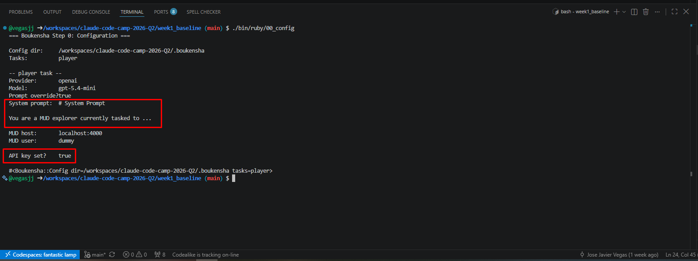
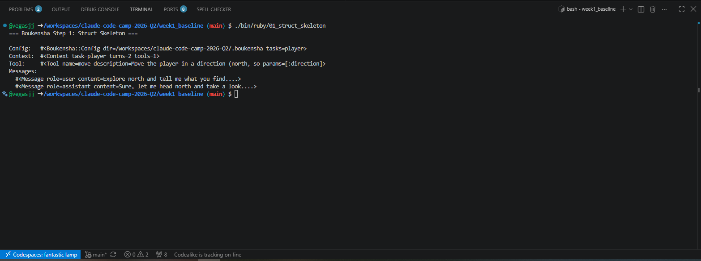
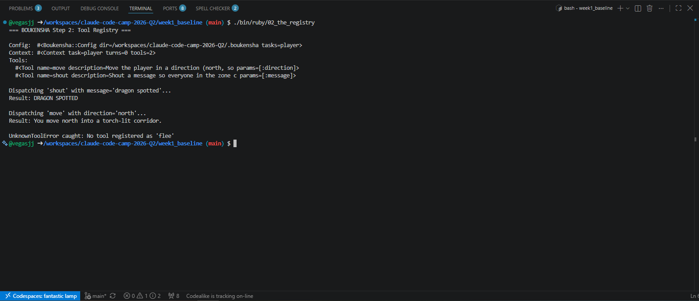
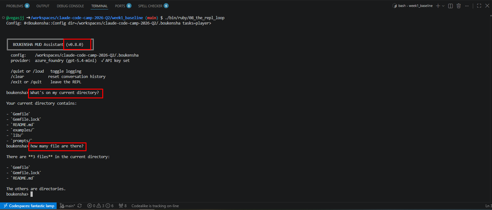
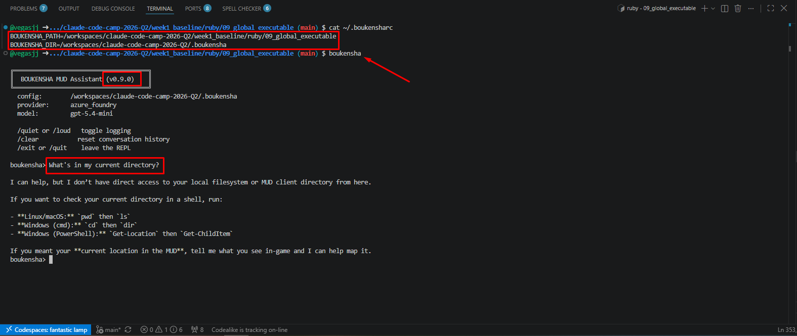
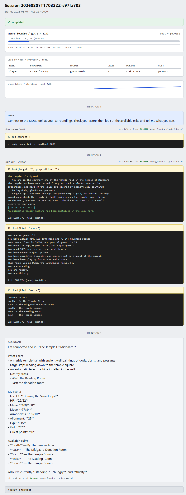
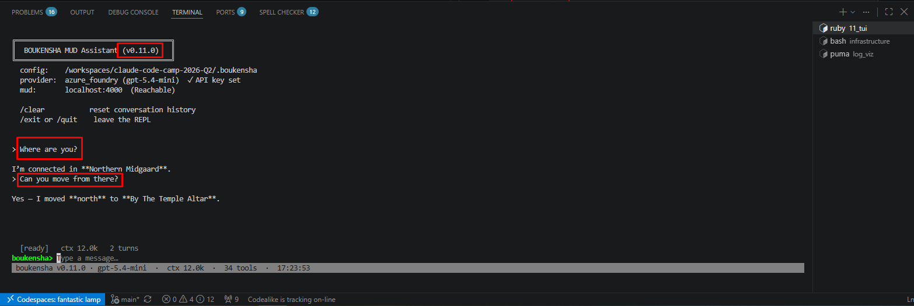
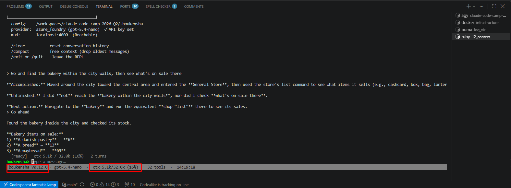

# Baseline Agent Journal

## Technical Goal

It is necessary to develope a custom agentic harness caplable of navigating a [MUD](https://en.wikipedia.org/wiki/Multi-user_dungeon) (especifically [tbaMud](https://github.com/tbamud/tbamud)), the baseline agent should be generic enough to be used with any kind of MUD so connections to the game should be handled separetaly.

## Technical Uncertainty

- Based on previous tests, generic harnesses cant't handle MUD connections reliably enough, so a custom harness could be the solution to do this programatically and be considered in production environments.
- Even if a custom harness is fully implemented there's no warranty that it can suffitiently constrain an LLM to the task and hand or without major deviations.
- Generic harnesses can't hold long term memory effectively beyong their current session so specialized memory migth be needed so the agent can learn about the MUD world and improve navigation between sessions.
- A specialized agentic loop seems to be necessary so LLM's can laverage a feedback loop while navigating the world or requesting input from the user so the agent can be ketp on target.
- LLM locking should not be a limitation for the custom harness so it makes sense any LLM could be used to match specific needs and to improve perfomance and cost.

## Technical Hypotheses

- If LLM or model selection must be implemented, its logic should be abstrated so the agent remain LLM agnostic and can talk with as many models as necessary.
- If a baseline agent is to be developed, it should be reduce to its basic components to remain modular and flexible. At the very least it should contain: **configuration**, **basic structure**, **tool registry**, **prompt builder**, **model api client**, **agentic loop**, **logger**, **dsl**, **repl loop**, **global executable**, **standard tool library** and **tui**.

## Technical Observations

A [base agentic harness](https://github.com/ExamProCo/claude-code-camp-2026-Q2) by **Andrew Brown**, called **Boukensha**, is used in this repo due to time constrains. Some modifications to the model backend logic were made to support **Microsoft Foundry** as an additional provider among other minor modifications that will be detailed when relevant.

Each [module](../../week1_baseline/ruby/) is implemented and tested one at the time while carrying delta changes as progress is made to the [final version](../../week1_baseline/ruby/12_context/).

### Config

Basic agent harness configuration is based on access to configuration directory, provider and model to be used, system prompt, MUD credentials and connection details as well as API keys. 

Bellow there's a capture with the output of a correct configuration using the **openai** provider and matching API keys:

 

### Struct Skeleton

The basic structure for an agent request is  based on message handling (user, assistant, etc.) during conversations and context or tool access:

Bellow is the test output depicting the mentioned structure:

 

### Registry

This module manages tool registration and access based on the current task as well as error handling for calls to unregistered tools.

Bellow is output of the module test showing the process of tool registering and dispatching (tool result):



### Prompt Builder

```sh
@vegasjj ➜ /workspaces/claude-code-camp-2026-Q2/week1_baseline (main) $ ./bin/ruby/03_prompt_builder 
=== BOUKENSHA Step 3: Prompt Builder ===

Config: #<Boukensha::Config dir=/workspaces/claude-code-camp-2026-Q2/.boukensha tasks=player>
Provider: azure_foundry
Model: gpt-5.4-mini
{
  "model": "gpt-5.4-mini",
  "instructions": "# System Prompt\n\nYou are a MUD explorer currently tasked to play TbaMUD. Your primary purpose is to follow instruction within the MUD to move, map, level-up, and fight enemies.",
  "input": [
    {
      "role": "user",
      "content": "I just arrived in the dungeon. What's around me, and can you move north?"
    },
    {
      "role": "assistant",
      "content": "Let me take a look around first."
    },
    {
      "type": "function_call_output",
      "call_id": "toolu_01X",
      "output": "A damp stone corridor stretches north. Torches flicker on the walls."
    }
  ],
  "tools": [
    {
      "type": "function",
      "name": "look",
      "description": "Look around the current room for details",
      "parameters": {
        "type": "object",
        "properties": {},
        "required": []
      }
    },
    {
      "type": "function",
      "name": "move",
      "description": "Move the player in a direction (north, south, east, west, up, down)",
      "parameters": {
        "type": "object",
        "properties": {
          "direction": {
            "type": "string",
            "description": "The direction to move"
          }
        },
        "required": [
          "direction"
        ]
      }
    }
  ],
  "max_output_tokens": 1024
}
```

### API Client

```sh
@vegasjj ➜ /workspaces/claude-code-camp-2026-Q2/week1_baseline (main) $ ./bin/ruby/04_api_client 
=== BOUKENSHA Step 4: API Client ===

Config: #<Boukensha::Config dir=/workspaces/claude-code-camp-2026-Q2/.boukensha tasks=player>
Provider: azure_foundry
Model: gpt-5.4-mini
Sending request to https://claude-code-camp-resource.openai.azure.com/openai/v1/responses...

Raw response:
{
  "id": "resp_0a1713d9d3085209006a76125b714c8196be557c81ff1c5b20",
  "object": "response",
  "created_at": 1786122843,
  "status": "completed",
  "background": false,
  "completed_at": 1786122844,
  "content_filters": [
    {
      "blocked": false,
      "source_type": "prompt",
      "content_filter_raw": [],
      "content_filter_results": {
        "hate": {
          "filtered": false,
          "severity": "safe"
        },
        "sexual": {
          "filtered": false,
          "severity": "safe"
        },
        "violence": {
          "filtered": false,
          "severity": "safe"
        },
        "self_harm": {
          "filtered": false,
          "severity": "safe"
        },
        "jailbreak": {
          "detected": false,
          "filtered": false
        }
      },
      "content_filter_offsets": {
        "start_offset": 0,
        "end_offset": 73,
        "check_offset": 0
      }
    },
    {
      "blocked": false,
      "source_type": "completion",
      "content_filter_raw": [],
      "content_filter_results": {
        "protected_material_code": {
          "detected": false,
          "filtered": false
        },
        "protected_material_text": {
          "detected": false,
          "filtered": false
        },
        "hate": {
          "filtered": false,
          "severity": "safe"
        },
        "sexual": {
          "filtered": false,
          "severity": "safe"
        },
        "violence": {
          "filtered": false,
          "severity": "safe"
        },
        "self_harm": {
          "filtered": false,
          "severity": "safe"
        }
      },
      "content_filter_offsets": {
        "start_offset": 0,
        "end_offset": 12,
        "check_offset": 0
      }
    }
  ],
  "error": null,
  "frequency_penalty": 0.0,
  "incomplete_details": null,
  "instructions": "# System Prompt\n\nYou are a MUD explorer currently tasked to play TbaMUD. Your primary purpose is to follow instruction within the MUD to move, map, level-up, and fight enemies.",
  "max_output_tokens": 1024,
  "max_tool_calls": null,
  "model": "gpt-5.4-mini",
  "moderation": null,
  "output": [
    {
      "id": "fc_0a1713d9d3085209006a76125bdd388196acbc42267e472fe6",
      "type": "function_call",
      "status": "completed",
      "arguments": "{\"path\":\".\"}",
      "call_id": "call_VAMmKDZ9ykJ6odoTaZHCO5jq",
      "name": "list_directory"
    }
  ],
  "parallel_tool_calls": true,
  "presence_penalty": 0.0,
  "previous_response_id": null,
  "prompt_cache_key": null,
  "prompt_cache_retention": "in_memory",
  "reasoning": {
    "context": "current_turn",
    "effort": "none",
    "mode": "standard",
    "summary": null
  },
  "safety_identifier": null,
  "service_tier": "default",
  "store": true,
  "temperature": 1.0,
  "text": {
    "format": {
      "type": "text"
    },
    "verbosity": "medium"
  },
  "tool_choice": "auto",
  "tools": [
    {
      "type": "function",
      "description": "Read the contents of a file from disk",
      "name": "read_file",
      "parameters": {
        "type": "object",
        "properties": {
          "path": {
            "type": "string",
            "description": "The file path to read"
          }
        },
        "required": [
          "path"
        ],
        "additionalProperties": false
      },
      "strict": true
    },
    {
      "type": "function",
      "description": "List files in a directory",
      "name": "list_directory",
      "parameters": {
        "type": "object",
        "properties": {
          "path": {
            "type": "string",
            "description": "The directory path to list"
          }
        },
        "required": [
          "path"
        ],
        "additionalProperties": false
      },
      "strict": true
    }
  ],
  "top_logprobs": 0,
  "top_p": 0.98,
  "truncation": "disabled",
  "usage": {
    "input_tokens": 133,
    "input_tokens_details": {
      "cached_tokens": 0
    },
    "output_tokens": 18,
    "output_tokens_details": {
      "reasoning_tokens": 0
    },
    "total_tokens": 151
  },
  "user": null,
  "metadata": {}
}
```

```sh
@vegasjj ➜ /workspaces/claude-code-camp-2026-Q2/week1_baseline (main) $ ./bin/ruby/05_agent_loop 
=== BOUKENSHA Step 5: Agent Loop ===

Config: #<Boukensha::Config dir=/workspaces/claude-code-camp-2026-Q2/.boukensha tasks=player>
Provider: azure_foundry
Model: gpt-5.4-mini
Max iterations: 25
Max output tokens: 1024

[iteration 1/25]
  tool call → read_file({"path" => "README.md"})
  tool result → # The Agent Loop

The Agent Loop is the heart of BOUKENSHA. E
[iteration 2/25]

=== FINAL RESPONSE ===
This framework, **BOUKENSHA**, is a MUD-player assistant that provides an **agent loop** for automated gameplay and task execution. From the README, it can:

- **Send requests to an LLM API** and keep looping until the model finishes.
- **Handle tool use automatically**:
  - detect when the model wants to call tools,
  - dispatch those tools through a registry,
  - feed the results back to the model as tool results.
- **Support multiple AI providers/backends**:
  - Anthropic
  - OpenAI
  - Azure OpenAI / Azure Foundry
  - Google Gemini
  - Ollama
  - Ollama Cloud
- **Normalize different provider response formats** into one common internal shape, so the agent loop doesn’t need provider-specific logic.
- **Replay conversation history correctly** by converting normalized messages back into provider-specific assistant messages when needed.
- **Use task-based configuration**, especially for a `player` task, including:
  - provider
  - model
  - system prompt override
  - max iterations
  - max output tokens
- **Validate models and expose backend metadata** like context window and token cost estimates.
- **Prevent runaway loops** with a maximum iteration cap and a final wrap-up call.
- **Work with MUD-focused actions** like reading files, listing directories, moving, mapping, leveling, and fighting, based on the system prompt and tool framework.

In short: it’s an **LLM-driven automation framework** built to let a game-playing assistant act through tools in a controlled loop, with support for multiple model providers and task-specific behavior.
```

[sessions](../../.boukensha/sessions/)

[log visualizer](../../week1_baseline/log_viz/)

```sh
@vegasjj ➜ /workspaces/claude-code-camp-2026-Q2/week1_baseline (main) $ ./bin/ruby/07_the_run_dsl 
=== BOUKENSHA Step 7: The Boukensha.run DSL ===

Config: #<Boukensha::Config dir=/workspaces/claude-code-camp-2026-Q2/.boukensha tasks=player>


=== FINAL RESPONSE ===
This README describes a **MUD player assistant framework** centered around a simple Ruby DSL called **`Boukensha.run`**.

What it can do:

- **Wrap all setup into one call**  
  Instead of manually wiring together context, registry, backend, prompt builder, client, logger, and agent, you can just call `Boukensha.run(...)`.

- **Let you describe a task in plain terms**  
  You pass a `task:` like “Read this file” or, in the MUD context, actions such as moving, mapping, leveling, or fighting.

- **Support multiple AI providers**  
  It can run with different backends, including:
  - Anthropic
  - OpenAI
  - Azure Foundry
  - Gemini
  - Ollama
  - Ollama Cloud

- **Use tools via a tiny DSL**  
  Inside the block, you can register tools with `tool "name" ... do ... end`.  
  This lets the agent interact with external capabilities such as:
  - reading files
  - listing directories
  - and, by extension, any action you define

- **Manage prompts and context automatically**  
  It handles:
  - system prompt
  - model selection
  - token budget
  - max response tokens

- **Log sessions**  
  It can print progress and write session logs to `.boukensha/sessions/<session-id>.jsonl` by default.

In short: **it’s a streamlined agent framework for instructing an AI to use tools and carry out tasks, with the intended use case being a MUD-playing assistant that can explore, map, level, andfight.**
```











## Technical Conclusions

## Key Takeaway
